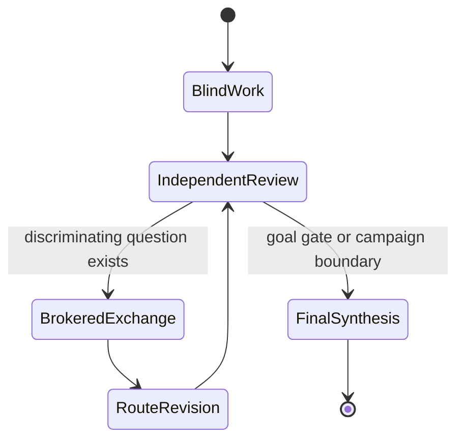

# ∞ Hilbert XVI · Dual-Argus Research Observatory

### Two isolated research processes · Evidence-first coordination

**[Landing page](README.md) · [中文](README.zh-CN.md) · [Live runtime](status/live.md)**

---

## Research question

Determine the maximum number and possible relative configurations of limit cycles of planar polynomial vector fields of degree $n$: Hilbert's sixteenth problem, Part II.

The campaign has four explicit goals:

1. establish a reliable and traceable baseline of known results;
2. run two independently reasoned Argus campaigns with deliberately different mechanisms;
3. seek a new provable lemma, construction, lower bound, configuration constraint, or result for a meaningful subclass;
4. claim a complete solution only if the original statement, with all quantifiers, is proved.

## Live status

| Field | Argus A | Argus B |
|---|---|---|
| Workspace | `math1/` | `math2/` |
| Primary lens | theory, finiteness, upper constraints, configurations | constructions, lower bounds, bifurcations, computation |
| Stage | `scope`: formalize Hilbert number and configurations | `scope`: establish rigorous conventions and scope |
| Daemon | running · PID `1932482` | running · PID `1932685` |
| Current task | formalize Hilbert number/configuration relation | establish rigorous conventions/problem scope |
| Last reviewed progress | none yet; first Engineer round active | none yet; first Engineer round active |
| Blocker | none operational | none operational |
| Detail | [View A](status/argus-a.md) | [View B](status/argus-b.md) |

## Coordination lifecycle

## Scientific state

- **Complete solution:** not claimed
- **New Reviewer-confirmed result:** none yet
- **Computational evidence:** none yet
- **Retired routes:** none yet
- **Smallest active proof gap:** pending completion of both scope stages

## Update policy

- breakthroughs, route retirement, and major blockers: commit immediately;
- routine status: commit every three hours when substantive state changed;
- neither Argus process may read this repository, and this repository is not an exchange channel;
- final output will include separate Chinese and English reports, LaTeX sources, and PDFs.

_Both isolated campaigns launched successfully at 2026-08-12 14:19 UTC._
