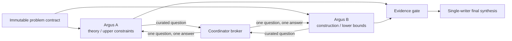

# ∞ Hilbert XVI · Dual-Argus Observatory

### Two isolated research processes, one evidence-first coordination layer

**[中文仪表板](README.zh-CN.md) · [English dashboard](README.en.md)**

---

## Live mission / 当前任务

Investigate the maximum number and relative configurations of limit cycles of planar polynomial vector fields of degree $n$—Hilbert's sixteenth problem, Part II—through two isolated Argus research campaigns.

通过两个彼此隔离的 Argus 研究进程，研究平面 $n$ 次多项式向量场极限环的最大数目与相对配置，即 Hilbert 第十六问题第二部分。

## Isolation contract

| Surface | Argus A | Argus B | Coordinator |
|---|---:|---:|---:|
| `math1/` | read/write | **forbidden** | audit |
| `math2/` | **forbidden** | read/write | audit |
| `talk/A-*` | scoped mailbox | no direct writes | broker |
| `talk/B-*` | no direct writes | scoped mailbox | broker |
| this repository | **forbidden** | **forbidden** | sole writer |

## Scientific integrity

This repository distinguishes **complete solution**, **verified partial result**, **computational evidence**, **known theorem**, **conjecture**, and **failed route**. A larger finite search, a plausible argument, or agreement between agents is never reported as a proof of a universal claim.

> This repository is an observability record, not a communication channel between the two research processes.

_Last dashboard initialization: 2026-08-12 14:08 UTC._
