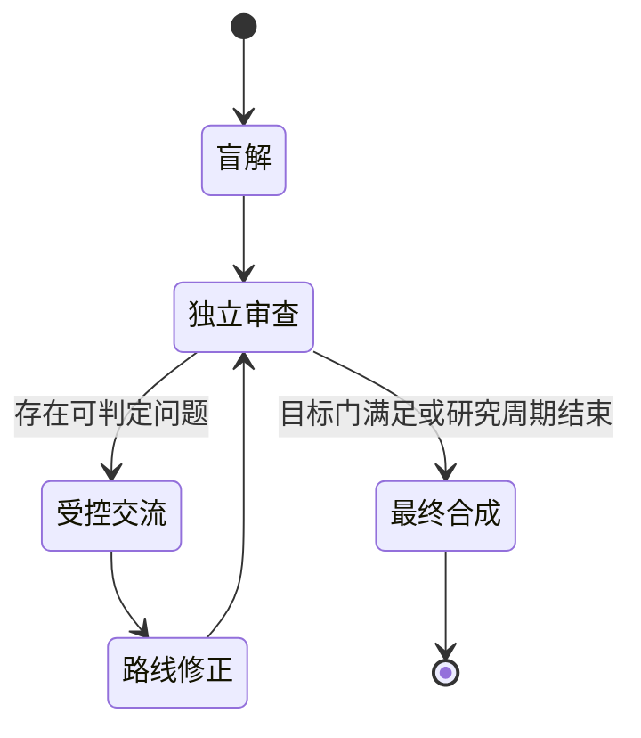

# ∞ Hilbert XVI · 双 Argus 研究观测站

### 两个隔离研究进程 · 一套证据优先的协调机制

**[总入口](README.md) · [English](README.en.md)**

---

## 研究问题

研究平面 $n$ 次多项式向量场极限环的最大数目及其相对位置，即 Hilbert 第十六问题第二部分。

目标同时包括：

1. 建立可信、可追溯的已知结果基线；
2. 让两个 Argus 采用不同机制独立推导；
3. 尝试获得新的可证明引理、构造、下界、配置约束或特定子类结果；
4. 只有在原问题全部量词和结论得到证明时才宣称完整解决。

## 实时状态

| 项目 | Argus A | Argus B |
|---|---|---|
| 工作区 | `math1/` | `math2/` |
| 优先视角 | 理论、有限性、上界与配置约束 | 构造、下界、分岔与计算反证 |
| 当前阶段 | 初始化 | 初始化 |
| daemon | 尚未启动 | 尚未启动 |
| 最近经审查进展 | 无 | 无 |
| 当前阻塞 | 等待启动预检 | 等待启动预检 |
| 详细状态 | [查看 A](status/argus-a.md) | [查看 B](status/argus-b.md) |

## 调度流程

## 科学状态

- **完整解决：** 尚未宣称
- **经 Reviewer 确认的新结果：** 暂无
- **计算证据：** 暂无
- **已否定路线：** 暂无
- **当前最小证明缺口：** 等待两个进程完成 scope 阶段

## 更新政策

- 突破、路线否定和重大阻塞：立即提交；
- 普通状态：每 3 小时在发生实质变化时提交；
- 两个 Argus 不读取本仓库，本仓库不承担交流功能；
- 最终将发布中文与英文两个版本的报告，并保留 LaTeX 源文件和 PDF。

_初始化时间：2026-08-12 14:08 UTC。_
